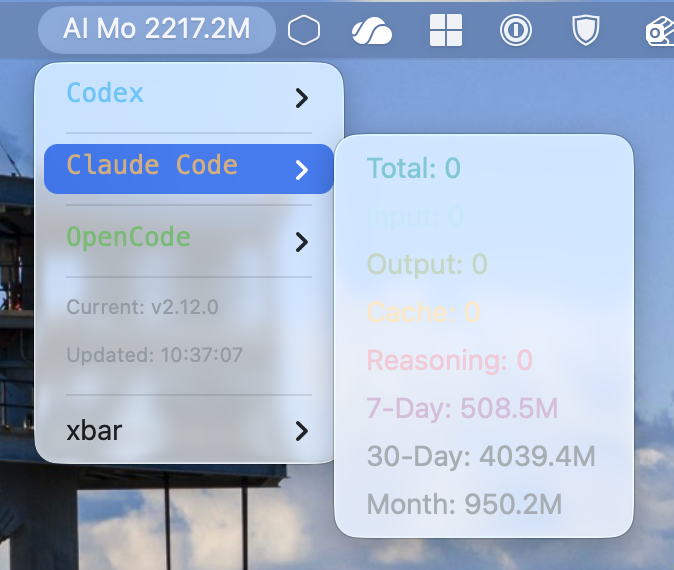

# xbar AI Token Usage

A [xbar](https://github.com/matryer/xbar) plugin that displays daily token usage statistics for [Qwen Code](https://github.com/QwenLM/qwen-code), Codex, [OpenCode](https://github.com/opencode-ai/opencode) and [Claude Code](https://claude.ai/code) in your macOS menu bar.



## Features

- Display token usage for Qwen Code, Codex, OpenCode, and Claude Code
- Real-time statistics: Total, Input, Output, Cache, Thoughts/Reasoning
- 7-day, 30-day and current-month totals
- Current model name from settings
- Auto-refresh every minute
- Color-coded output for easy reading
- **Built-in auto-update** - Check and install updates from menu

## Prerequisites

**xbar must be installed first!** Download from [xbarapp.com](https://xbarapp.com) or install via Homebrew:

```bash
brew install --cask xbar
```

After installation, launch xbar and follow the setup instructions.

## Installation

### For Humans

Use this if you are installing the widget yourself.

Recommended one-liner:

```bash
curl -sSL https://raw.githubusercontent.com/foxleoly/xbar-ai-usage/master/install.sh | bash
```

Manual install:

```bash
mkdir -p ~/Library/Application\ Support/xbar/plugins
curl -o ~/Library/Application\ Support/xbar/plugins/opencode-usage.1m.py \
  https://raw.githubusercontent.com/foxleoly/xbar-ai-usage/master/opencode-usage.1m.py
chmod +x ~/Library/Application\ Support/xbar/plugins/opencode-usage.1m.py
open -a xbar
```

### For Agents

Use this if Codex, Claude Code, OpenCode, or another coding agent is installing from a local checkout.

```bash
git clone https://github.com/foxleoly/xbar-ai-usage.git
cd xbar-ai-usage
python3 .codex/skills/xbar-ai-usage-installer/scripts/install_xbar_plugin.py --dry-run
python3 .codex/skills/xbar-ai-usage-installer/scripts/install_xbar_plugin.py
open -a xbar
```

The repository includes a Codex skill at:

```text
.codex/skills/xbar-ai-usage-installer/SKILL.md
```

Agents should run the dry-run first, verify the target path, then install. The installer backs up an existing plugin as `opencode-usage.1m.py.bak.off` and copies the current repository script into the xbar plugin directory.

## Requirements

- **[xbar](https://xbarapp.com)** - Required! This plugin runs inside xbar.
- macOS (xbar is macOS only)
- Python 3.x (usually pre-installed on macOS)

> ⚠️ **Note**: This plugin will not work without xbar. Make sure xbar is installed and running before installing this plugin.

## Data Sources

This plugin reads token usage data from the following locations:

| Tool | Data Path | Description |
|------|-----------|-------------|
| Qwen Code | `~/.qwen/projects/*/chats/*.jsonl` | JSONL log files |
| Codex | `~/.codex/state_5.sqlite` and `~/.codex/sessions/**/*.jsonl` | SQLite thread index plus JSONL rollout token counters |
| Claude Code | `~/.claude/projects/*/*.jsonl` | JSONL log files |
| OpenCode | `~/.local/share/opencode/opencode.db`, `~/.local/share/opencode-alt/opencode/opencode.db` | SQLite database |

> 📝 **Note**: Qwen Code, Codex, Claude Code, and OpenCode are NOT required dependencies. The plugin will simply show "No data" or hide the section if the corresponding data source doesn't exist.

## Configuration

The plugin reads model configuration from `~/.qwen/settings.json` to display friendly model names.

Example `settings.json`:
```json
{
  "model": {
    "name": "glm-5"
  },
  "modelProviders": {
    "openai": [
      {
        "id": "glm-5",
        "name": "[Bailian Coding Plan] glm-5"
      }
    ]
  }
}
```

## Output Example

```
QC 7.9M / Codex 6.2M / CC 1.3M / OC 1.2M
---
Qwen Code
--Total: 7.9M
--Input: 7.8M
--Output: 73.1K
--Cache: 6.7M
--Thoughts: 28.8K
--7-Day: 49.5M
--30-Day: 49.5M
--Model: [Bailian Coding Plan] glm-5
---
Codex
--Total: 6.2M
--Input: 6.1M
--Output: 19.3K
--Cache: 5.5M
--Reasoning: 2.8K
--7-Day: 83.7M
--30-Day: 412.9M
--Month: 412.9M
---
Claude Code
--Total: 1.3M
--Input: 1.3M
--Output: 4.1K
--Cache: 503.9K
--Reasoning: 0
--7-Day: 1.3M
--30-Day: 1.3M
--Month: 1.3M
---
OpenCode
--Total: 1.2M
--Input: 343.8K
--Output: 16.0K
--Cache: 860.1K
--Reasoning: 4.8K
--7-Day: 53.0M
--30-Day: 53.0M
--Model: [Bailian Coding Plan] glm-5
---
Updated: 20:06:28
```

## Customization

### Auto-Update

The plugin includes a built-in auto-update feature:

- When a new version is available, an update notification appears in the menu
- Click "🔄 Update to vX.X.X" to install the latest version automatically
- The plugin will refresh after updating

### Manual Update

You can also update manually:

```bash
curl -sSL https://raw.githubusercontent.com/foxleoly/xbar-ai-usage/master/install.sh | bash
```

### Refresh Interval

Change the filename suffix to adjust refresh rate:
- `opencode-usage.1m.py` - every 1 minute
- `opencode-usage.5m.py` - every 5 minutes
- `opencode-usage.1h.py` - every 1 hour

### Colors

Edit the `color=` parameters in the script to customize colors. Supported formats:
- Named colors: `red`, `green`, `blue`
- Hex colors: `#00bcd4`, `#81d4fa`

## Uninstallation

```bash
rm ~/Library/Application\ Support/xbar/plugins/opencode-usage.1m.py
```

## License

MIT License
